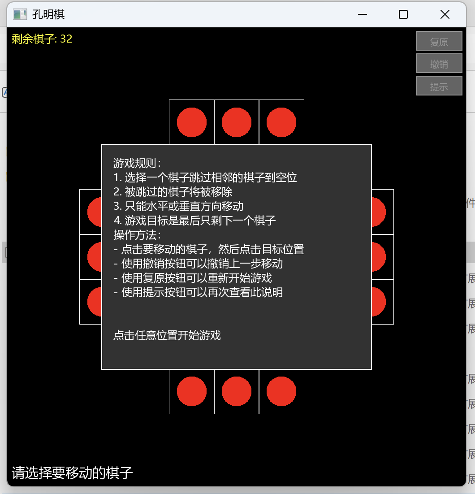
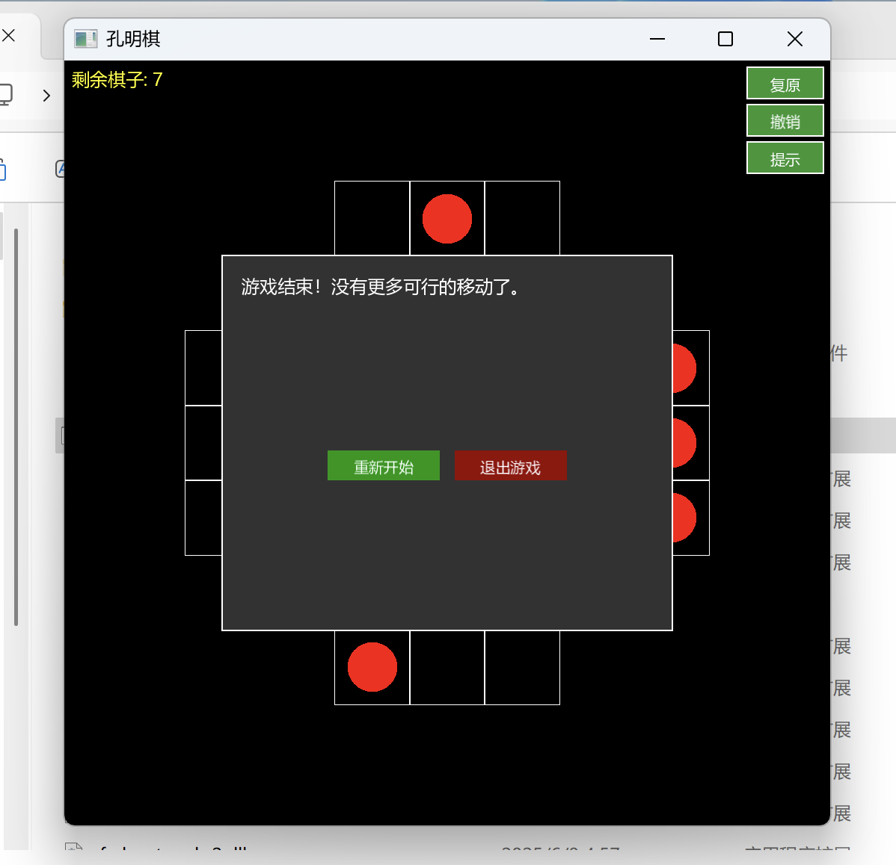
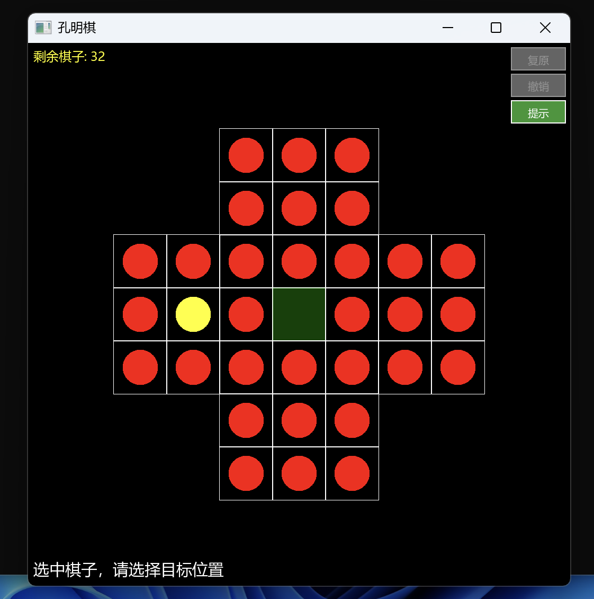

# 孔明棋游戏 (KongMingQi)

这是一个使用C++和SFML图形库开发的孔明棋（单人跳棋）游戏。游戏采用图形化界面，支持鼠标操作，为玩家提供了友好的游戏体验。

**PS：本文所指均为Windows下，虽然SFML支持跨平台，但是由于兼容等原因需要部分修改**

## 游戏介绍

孔明棋是一种古老的益智游戏，玩家需要通过跳棋的方式移动棋子，目标是最后只剩下一颗棋子。每次移动时，棋子需要跳过另一颗棋子并将其移除，直到无法继续移动为止。

## 游戏截图

### 开始游戏
游戏主界面展示了标准的7x7棋盘布局，以及当前剩余棋子数量。界面清晰直观，操作简单。游戏开始时会首先提示用户游戏规则。



### 游戏运行
当选中棋子时，系统会自动显示可移动的位置，帮助玩家做出正确的移动。



### 游戏结束提示
游戏结束时会显示相应的提示信息，玩家可以选择重新开始或退出游戏。



## 功能特性

- 图形化界面，支持鼠标操作
- 7x7的标准棋盘布局
- 实时显示剩余棋子数量
- 移动提示功能，显示可移动的位置
- 撤销上一步功能
- 复原棋盘功能
- 游戏提示功能
- 游戏结束判定
- 重新开始和退出选项

## 技术栈

- C++17
- SFML图形库，版本2.6
- CMake构建系统

## 构建说明

### 依赖要求

- CMake
- MinGW-w64 或其他C++编译器
- SFML库

### 构建步骤

1. 先修改配置文件
```
# 设置本地SFML路径，更换为你的SFML路径
set(SFML_ROOT "C:/Users/winter/Desktop/SFML-2.6.2")
set(SFML_INCLUDE_DIR "${SFML_ROOT}/include")
set(SFML_LIBRARY_DIR "${SFML_ROOT}/lib")
```

2. 创建构建目录：

```bash
mkdir build
cd build
```

3. 配置CMake：

```bash
cmake .. -G "MinGW Makefiles"
```

4. 编译项目：

```bash
mingw32-make
```

编译完成后，可执行文件将在`build`目录下生成。

## 运行要求

要在没有C++环境的系统上运行，需要以下DLL文件：

- SFML相关DLL文件（已包含）
- libgcc_s_seh-1.dll
- libstdc++-6.dll
- libwinpthread-1.dll

请确保这些DLL文件与可执行文件在同一目录下，如果无需编译直接使用，请运行`/kongmingqi/build/KongMingQi.exe`即可

## 游戏操作

- 使用鼠标点击选择要移动的棋子
- 点击目标位置完成移动
- 使用界面上的按钮进行撤销、重置等操作
- 游戏结束时可选择重新开始或退出

## 开发者

如果您想参与开发，可以查看源代码中的以下主要文件：

- `include/Board.h`：棋盘逻辑实现
- `include/Game.h`：游戏核心逻辑
- `include/GameGUI.h`：图形界面实现
